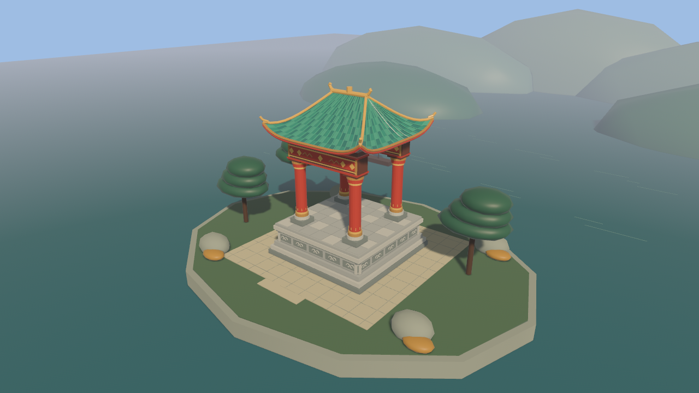

# 黄鹤楼积木：筑梦江城（Phoenix Tower）

基于 **Rust + Bevy 0.19** 的轻量级 3D 积木搭建游戏：以武汉黄鹤楼为主题，玩家通过放置模块化积木**精准复原**、**自由创造**或**挑战重建**这座千年名楼。

> 状态：**Phase 0-3 自动可交付项全部完成**（仅剩人工验收与 Web 决策）
> 产品方案：`docs/PRD.md` ｜ 评审报告：`docs/REVIEW.md` ｜ 任务清单：`docs/BACKLOG.md` ｜ 技术决策：`docs/adr/`
> 人工验收清单：`docs/ACCEPTANCE.md` ｜ Web 移植评估：`docs/WEB_ASSESSMENT.md`

## 快速开始

环境要求：Rust ≥ 1.88（推荐 1.92+）。

```bash
cargo run          # 开发模式运行（首次编译 Bevy 需 5-15 分钟）
cargo check        # 快速编译检查
cargo test         # 单元与无窗口 ECS 回归测试
PHOENIX_STRESS=50000 cargo run   # 压力模式：自动生成 5 万积木并每 2s 采样 FPS
```

### 操作

| 操作 | 说明 |
|------|------|
| 左键点击 | 放置当前积木（点击而非拖拽） |
| 左键拖拽 | 轨道旋转视角 |
| 右键拖拽 | 平移视点 |
| 滚轮 | 缩放 |
| `1`-`9` / `Q` / `E` | 选择积木（或点击左侧面板；当前 35 种，见 `resources/blocks/`） |
| `R` | 旋转当前积木 90°（步进 0/90/180/270°，蓝图模式需对齐蓝图朝向） |
| `M` | 切换 蓝图模式 / 自由模式（蓝图模式仅可放置蓝图期望格，完成度进度条实时显示） |
| `L` | 中/英 界面语言切换 |
| `X` | 拆除模式：点击移除积木（支撑拆除） |
| `G` | 重力测试：结构沉降 3 秒 → 存活率星级（按 G 复原） |
| `T` | 昼夜切换（平滑过渡） |
| `F5`/`F6`/`F7`/`F8`/`F9` | 保存 / JSON 导出 / 分享导出 / 导入最新 / 读取槽位 |
| `Backspace` / `Ctrl+Z` / `Ctrl+Y` | 撤销 / 撤销 / 重做（20 步 Command 历史） |
| `N` | 跳过新手教程（启动时自动进入三步引导：大台基→高柱→重檐大梁） |
| `C` | 开始 / 重试挑战（面板可切换：限时复原 300s / 极速复原 120s；星级 = 时间充裕度） |
| `F2` | 截图 PNG（保存到 `saves/`） |
| `K` | 知识提示开关（蓝图停顿弹文化卡片） |
| `Esc` | 退出 |

## 已交付内容（Phase 0-3 + 形制升级）

- [x] Bevy 0.19.1 工程骨架（模块结构对齐 PRD §4 代码组织建议）
- [x] 轨道相机（旋转 / 缩放 / 平移，参数有界）
- [x] 射线放置：`viewport_to_world` + 网格吸附 + 幽灵预览 + 重叠禁止 + 撤销
- [x] **积木定义数据驱动化（B-06）**：`resources/blocks/*.ron`（35 种积木、6 个结构层级、文化描述），多尺寸放置 + `HashSet` O(1) 占用查重
- [x] **蓝图模式（B-08）**：三维堆叠放置、严格吸附 + 红/绿幽灵反馈、层级加权完成度（ADR-005）；**官方数据五层收分黄鹤楼蓝图（331 格）** + 滕王阁/岳阳楼主题、严格吸附 + 红/绿幽灵反馈、层级加权完成度（ADR-005）、匹配算法单元测试 6 例
- [x] **本地存档（B-11）**：`.ptw`（bincode）+ JSON 导出、原子写入、版本迁移链（ADR-006）、单测 3 例
- [x] **基础 UI（B-10）**：**Bevy-Lunex 保留模式 UI**（2026-09 重构，替代 bevy_egui）：积木面板（35 种、点击选中、悬停/选中高亮、滚轮滚动）+ 完成度进度条 + 主题/挑战下拉 + 存档 Tab（保存/JSON/分享/导入/路径输入）+ 图鉴/成就 Tab + 知识卡片 toast + 透明度滑杆；**20 步撤销/重做**（Command 模式）+ CJK 子集字体（16.4MB → 318KB）
- [x] **新手教程（B-12）**：三步强制蓝图引导（大台基→高柱→重檐大梁），自动选中积木、N 键跳过
- [x] **挑战模式（B-16）**：多挑战（限时复原 300s / 极速复原 120s）+ 材料配额 + 限旋转；星级 = 时间充裕度（>50% 三星），C 键启动，配额贯穿撤销/重做
- [x] **图鉴与成就（B-18）**：部件图鉴（35 种，蓝图放置解锁 + 文化描述）、5 项成就、进度持久化（`saves/progress.json`）
- [x] **音频（B-19）**：放置碰撞音（按积木分类）、完成编钟、长江水声 + 风铃环境音（程序化生成，`tools/gen_audio.py` 可复现）
- [x] **性能验证入口（B-20）**：FPS/积木数 HUD + `PHOENIX_STRESS=<n>` 渲染压力模式 + 集合扫描 revision 门控（ADR-007）。新增限时、预热、多点采样与完整日志脚本；历史单点 FPS 不作为当前性能承诺，渲染压力实体也不代表可编辑建筑或物理规模。实际结果与限制见 `docs/refactoring/risk-followup.md`。
- [x] **截图导出（B-21）**：F2 一键 PNG（离屏渲染目标方案，规避 Metal swapchain 读回黑帧问题）
- [x] **结构稳定性（B-17）**：avian3d 物理集成——G 键重力测试（存活率评分 + 星级）、X 键拆除模式（坍塌玩法闭环）、自动复原
- [x] **主题包框架（B-24）**：多蓝图数据驱动（黄鹤楼/滕王阁/岳阳楼）+ 多挑战选择，面板下拉切换——新增主题只需加 RON 文件
- [x] **分享机制（B-23）**：F7 分享导出 / F8 导入最新 / 面板存档管理（列表加载、路径导入）/ `PHOENIX_LOAD=<path>` 启动导入
- [x] **多语言与无障碍（B-25）**：L 键中/英切换（HUD/面板/教程/挑战/成就界面镀铬）、幽灵无效态脉冲（非纯颜色反馈）
- [x] **积木旋转（PRD §3.1）**：R 键 90° 步进，footprint 互换贯穿放置/撤销/重做/存档/蓝图匹配
- [x] **积木库与形制（B-07）**：35 种积木 + **程序化建筑网格**（圆柱柱础/攒尖顶/八角檐板/斗拱/坡瓦/宝顶/匾额板 + 琉璃瓦勾缝纹理）
- [x] **场景氛围（B-13）**：蛇山/长江 + 昼夜切换 + 距离雾 + 夜景灯笼辉光与点光源 + 程序化音效
- [x] 本机严格 Clippy 零警告 + Rust 回归测试 + 限时原生冒烟；具体数量、执行证据和已知中文诊断见风险验收记录。跨平台 CI 配置不等于远端已执行通过。
- [x] 技术决策记录（ADR-001~007）与评审修订落地

## 代码结构

```
src/
├── main.rs                 # 入口：插件注册
├── game_state.rs           # 游戏状态机骨架（Menu / Playing）
├── camera/
│   └── orbit_camera.rs     # 轨道相机系统
├── building/
│   ├── block_defs.rs       # 积木定义加载（RON 数据驱动）
│   ├── blueprint.rs        # 蓝图：稀疏格子匹配 + 完成度 + 主题库
│   ├── challenge.rs        # 挑战：配额/星级/多挑战
│   ├── collection.rs       # 图鉴成就 + 知识卡片
│   ├── meshes.rs           # 程序化建筑网格（攒尖顶/圆柱/斗拱等）
│   ├── placement.rs        # 三维射线放置 + 幽灵预览 + 玩法编排
│   ├── world.rs            # 完整建筑、占用索引与独立的 20 步撤销历史
│   ├── decorations.rs      # 灯笼/匾额子实体生命周期（每个父积木只挂载一次）
│   └── tutorial.rs         # 新手教程
├── camera/orbit_camera.rs  # 轨道相机 + 观赏视角 + 距离雾
├── scene/mod.rs            # 主场景：蛇山/长江/昼夜/雾
├── save/mod.rs             # 存档：bincode/JSON/迁移链/导入
├── audio/mod.rs            # 程序化音效
├── stability.rs            # avian3d 物理重力测试 + 拆除模式
├── screenshot.rs           # 离屏截图导出
├── stress.rs               # 压力测试模式
├── i18n.rs                 # 中/英切换
└── ui/
    ├── hud.rs              # HUD 提示（右下角）
    ├── lunex.rs            # Bevy-Lunex 插件注册与兼容导出
    └── lunex/              # layout / palette / saves / challenges / collection / probes / tests
assets/
├── fonts/                  # CJK 子集字体（B-10）
└── audio/                  # 程序化生成音效（tools/gen_audio.py）
resources/
├── blocks/                 # 积木定义（36 个 .ron，新增积木只需加文件）
├── blueprints/             # 蓝图（4 主题：黄鹤楼 331 格/滕王阁/岳阳楼/江岸亭）
└── challenges/             # 挑战（限时复原/极速复原）
docs/
├── PRD.md                  # 产品方案（原文）
├── REVIEW.md               # 评审报告（技术核实 + 产品建议）
├── BACKLOG.md              # 垂直切片任务清单（B-01 ~ B-27）
└── adr/                    # 架构决策记录（6 篇）
```

## 核心重构：建筑数据与 UI 职责分离

- **建筑不再受 20 块上限限制**：20 仅限制可撤销的最近放置次数，较早积木继续保留在场景、完成度和存档中。
- **统一数据变更**：放置、撤销、重做、拆除、导入、挑战重置统一维护占用索引与 revision；重力测试复原同步更新撤销实体引用。
- **读档开启新编辑会话**：保留全部导入积木，但清空上一个世界的撤销/重做历史；`.ptw` v1 格式不变。
- **装饰只挂载一次**：灯笼光源和匾额文字不再随无关建筑变化重复生成，压力测试积木继续排除。
- **UI 按功能拆分**：布局、积木/蓝图、存档、挑战、图鉴和诊断独立维护，保留现有布局与交互。

计划与验收记录见 `docs/refactoring/2026-09-05-core.md`。本轮不更换引擎、不添加依赖、不重做美术。

## 可复现的风险验证

```bash
cargo test --locked
cargo clippy --locked --all-targets -- -D warnings
cargo fmt --all -- --check
python3 -B -m unittest discover -s tools -p 'test_verify_runtime.py' -v

# 无窗口的 50k 可编辑建筑数据测试（含 20 次撤销/重做及存档往返）
cargo test --locked editable_world_50k_history_and_save_roundtrip -- --ignored --nocapture

# 独立构建原生程序；下列运行需要桌面/GPU，不在无窗口 CI 自动执行
cargo build --locked --profile test
python3 tools/verify_runtime.py --load saves/verify_plaque.ptw --screenshot
python3 tools/verify_runtime.py --stress 10000 --warmup 10 --duration 30 --timeout 150
```

`verify_plaque.ptw` 由 Rust 存档测试生成。Windows 使用 `python`；其他平台通常使用 `python3`。
工具默认在 `saves/verification/` 新建唯一结果目录，保留 `runtime.log`、`summary.json` 和可选新截图；
可以用 `--output-dir` 指定目录。达到观察时长或超时后仅终止自己启动的进程，不发送保存按键。
日志解析有 64 KiB 单行及 64 MiB 总字节预算，超限明确失败；原始日志保留，预算不等于磁盘配额。
CLI 回收进程和最后解析期间临时忽略重复 Ctrl-C，结束后恢复原信号处理器。
`--load`/`--screenshot` 不可与压力模式混用；运行中不要操作游戏或同时运行另一截图进程。
已知 ICU 分词诊断单独计数，其他识别到的错误、意外退出、缺少 UI/导入/截图/压力采样证据均判失败。
FPS 按日志生产时间划分窗口，避免积压日志混入预热后的采样；压力采样必须包含有效时间戳。
“通过”指验证流程和存活检查通过，**不是性能达标或中文排版已完全正确**。

CI 对 Linux/macOS/Windows 执行 locked 检查、无窗口测试、Clippy、格式和 Python 工具测试；
本机验证不替代远端 CI、真实平台 GPU 测试或人工完整试玩。

## 路线图

| 阶段 | 内容 | 状态 |
|------|------|------|
| Phase 0 | 技术验证：场景 + 相机 + 射线放置 | ✅ 完成 |
| Phase 1 | MVP：积木库/蓝图/UI/存档/完成度/教程 | ✅ 完成 |
| Phase 2 | 自由创造/挑战/物理/性能/截图 | ✅ 完成 |
| Phase 3 | 分享/主题包/多语言/形制升级 | ✅ 自动项完成（Web 决策待人工） |
| 待人工 | 试玩验收（ACCEPTANCE.md）/ B-26 Web 决策 / 全量美术与跨平台 glTF | ⏳ |

详见 `docs/BACKLOG.md` 与 `docs/RELEASE_READINESS.md`。


## Blender 江岸亭：可编辑 3D 样板



*实际游戏的离屏 3D 截图，不含 UI；不是 Blender 效果图。*

```bash
# 默认启动仍是原教程；显式选择样板，不需要安装 Blender 即可玩
cargo run --locked --profile test -- --riverside
# 或先 cargo build --locked --profile test，再运行：
./target/debug/phoenix-tower --riverside
```

样板由 **8 个真实积木**组成：石台、四根朱柱、两根梁枋、七格飞檐顶，不是整栋静态模型。
首次进入自由模式并选中亭顶；**Backspace 撤销屋顶 → M 打开蓝图 → 把绿色预览移到亭子上点击重建**。
也可 Ctrl/Cmd+Y 重做，左拖环绕、右拖平移、滚轮缩放，T 切换昼夜，F2 截图，F5 保存。
加载自己保存的 `.ptw` 继续编辑时，保持 `--riverside` 启动后使用原来的存档面板；初始化不会自动写任何存档。
如果同时指定 `PHOENIX_LOAD` 或 `PHOENIX_STRESS`，导入/压力模式优先，样板不会填充世界。

- 六种 Blender 模型：大台基、高朱柱、梁枋、楼板、斗拱、江亭顶。楼板/斗拱可从原积木面板单独选择。
- 高细节模型只在 `--riverside` 启用；普通与压力模式继续使用轻量程序化网格。缺少 GLB 文件时有带警告的程序化回退。
- 一个模型只有一个 mesh/primitive，使用顶点颜色，无外部贴图、无新增依赖、无逐积木场景树。
- 模型尺寸与占格一致，放置/撤销/重做/拆除/存档仍走同一数据路径，存档格式保持 v1。
- 新增短暂装配光环，最多响应同帧 16 个新积木，0.45 秒回收；不改变积木或碰撞体的变换。
- 江面、石岸、远山、松树是背景，不参与占格或物理。当前没有行走、游泳或水面物理。

### 重建模型与验证

源文件及导出位于 `assets/models/riverside/`；`riverside.blend` 可直接用 Blender 打开编辑。
脚本会覆盖自己生成的同名资产；手工修改源场景前请另存副本。

```bash
# 仅美术重新生成时才需要本机 Blender（以下为 macOS 路径）
/Applications/Blender.app/Contents/MacOS/Blender --background --factory-startup \
  --python tools/build_riverside_assets.py -- --output assets/models/riverside

# 直接检查已提交的 GLB，无需 Blender 或额外 Python 包
python3 -B -m unittest discover -s tools -p 'test_*.py' -v
# 原生样板/UI/截图冒烟，不写入存档槽位
python3 -B tools/verify_runtime.py --riverside --screenshot
# 连续帧率证据：UI/样板就绪后预热 5 秒，再观测 30 秒（截图另跑，避免干扰）
python3 -B tools/verify_runtime.py --riverside --measure-fps --warmup 5 --duration 30
```

设计边界、验证与尚未覆盖的风险见 `docs/design/riverside-slice.md`。

`--measure-fps` 显式开启约每秒一次的瞬时帧 FPS 日志，并要求预热后至少 3 个带生产时间戳的样本；
普通冒烟不强制 FPS，压力模式始终强制采样且不会重复开启 UI 采样器。
采样中位数不是整个窗口的平均吞吐或 GPU 耗时，也不代表跨平台帧率承诺。
后续中文排版重复失效修复、对照测量与剩余限制见 `docs/refactoring/riverside-risk-followup.md`。
